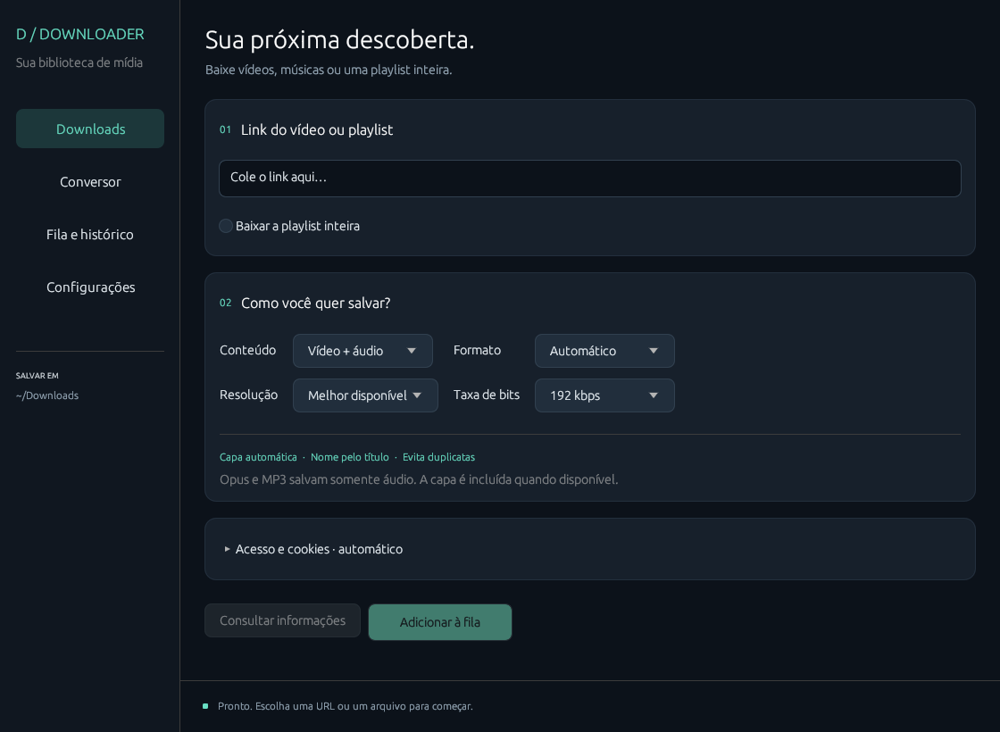
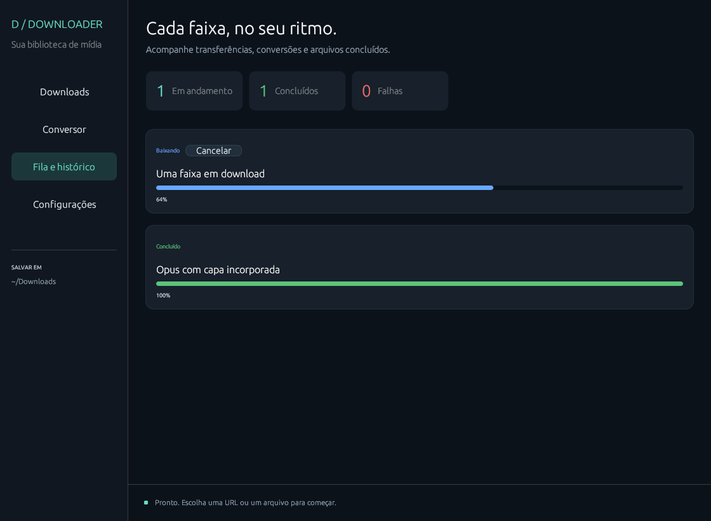

# Guia de uso

## Instalação rápida

O Linux precisa de `yt-dlp`, `ffmpeg` e `ffprobe` disponíveis no `PATH`.
Compile e registre o atalho de dois cliques:

```bash
cd /home/x/Documentos/Estudo/Downloader
./packaging/install-desktop.sh
```

Depois, abra **Downloader** no menu de aplicativos. Para executar sem menu,
use `rust/target/release/downloader-desktop`.

## Download

1. Cole a URL na tela **Downloads**.
2. Escolha tipo (vídeo + áudio, somente vídeo ou somente áudio), qualidade,
   formato, bitrate e se a URL é uma playlist.
3. Clique em **Analisar** para uma prévia rápida (playlists usam uma listagem
   plana) ou em **Adicionar à fila** para iniciar o download.
4. Acompanhe o estado em **Fila / Histórico**.

Os arquivos só aparecem no destino depois que a validação com `ffprobe` passa.
Se já existir um arquivo com o mesmo nome, a política padrão cria uma variante
com sufixo seguro.

## Conversão

Informe o arquivo, o contêiner de saída e a aceleração. **Automático** usa um
backend somente depois de uma sondagem bem-sucedida; **Software** é o fallback.
Vulkan depende de driver e dispositivo DRM acessíveis no host.

## Cookies e sites que exigem login

Na autenticação da tarefa, o modo padrão tenta automaticamente o primeiro
perfil local compatível. Se preferir, use um arquivo Netscape (`cookies.txt`)
ou um perfil de navegador suportado pelo yt-dlp. O arquivo deve permanecer
privado; ele é validado antes da execução e não é copiado para o histórico.
Também é possível usar a CLI:

```bash
./rust/target/release/downloader-cli download URL --cookies /caminho/cookies.txt
./rust/target/release/downloader-cli download URL --cookies-from-browser firefox
```

Use somente cookies de conteúdo que você está autorizado a acessar. Nunca
adicione arquivos de cookies ao repositório.

## CLI

```text
downloader-cli analyze <url> [--playlist]
downloader-cli download <url> [diretório] [--playlist]
downloader-cli convert <arquivo> [mp4|mkv|mp3|webm] [diretório]
```

Em ambientes sem compositor gráfico, a CLI permite verificar dependências,
análise e conversão local.

## Opus, capas e progresso por faixa

Escolha **Opus (áudio)** em Saída para extrair somente áudio. Opus e MP3 usam
thumb como capa quando o vídeo disponibiliza uma imagem. Para Opus, a capa é
gravada como `METADATA_BLOCK_PICTURE`, sem depender do módulo Python Mutagen.
MP4 e MKV também solicitam incorporação da thumbnail ao yt-dlp.

Os arquivos publicados usam o título do vídeo; caracteres incompatíveis são
normalizados pelo yt-dlp e títulos repetidos recebem um sufixo para preservar
arquivos existentes. A Fila / Histórico mostra uma linha por faixa, com título,
percentual de transferência, validação e conclusão. Cancelar uma faixa cancela
a tarefa da playlist à qual ela pertence. Os detalhes por faixa pertencem à
sessão atual; o histórico persistente conserva a tarefa da playlist.

Exemplo CLI:

```bash
./rust/target/release/downloader-cli download URL DIRETORIO --playlist --format opus --bitrate 128k
```

Para um estado isolado de teste, configure `DOWNLOADER_DATA_DIR`.

A capa é incorporada e a imagem temporária removida assim que cada faixa
termina, sem aguardar o restante da playlist. Faixas já publicadas permanecem
disponíveis caso uma faixa posterior falhe. A imagem geral da playlist não é baixada.

## Evitar downloads duplicados

Antes de baixar, a aplicação verifica os arquivos de mídia diretamente na pasta
de destino. O índice oculto `.downloader-library.json` relaciona cada arquivo
publicado com a identidade do vídeo. Arquivos antigos do YouTube também podem
ser reconhecidos pela URL de origem nos metadados (mesmo após renomeá-los).

A aplicação valida os streams com ffprobe, confere o formato solicitado e gera
um arquivo de controle temporário para o yt-dlp pular a transferência. A fila
mostra **Já existe — download pulado**. Arquivos apagados, corrompidos ou em outro
formato não são usados para pular a tarefa. A comparação é por vídeo e formato;
alterar apenas a taxa de bits não força novo download.

Arquivos sem identidade conhecida, parciais em pastas temporárias e arquivos em
subpastas não são considerados concluídos. Coincidência de título por si só não
é suficiente para descartar um vídeo. Mantenha o índice na pasta para preservar
a identificação em sites que não gravam a URL nos metadados.

## Interface

A navegação lateral reúne Downloads, Conversor, Fila e histórico e Configurações.
Downloads organiza link, opções de saída e acesso em cartões. Abra **Acesso e
cookies** somente para escolher uma fonte manual. A barra inferior mostra o
retorno mais recente da aplicação. Na fila, cada registro apresenta título,
estado e progresso; operações sem percentual usam um indicador de atividade.

Prévias renderizadas diretamente pelo egui, sem janela nativa:




## Esperas do YouTube

O aplicativo aplica uma pausa de 5 segundos e limita os inícios a 300 vídeos em
90 minutos quando **Ativar limite de segurança** está ligado (padrão). A
contagem permanece após fechar o programa. Ao atingir o limite, a fila mostra a
espera e retoma automaticamente; é possível cancelar. Desligar o toggle remove
esses argumentos de proteção para as próximas operações do YouTube. As
configurações exibem o estado atual. Consulte os
[detalhes, novas tentativas e fontes](YOUTUBE_LIMITS.md).
